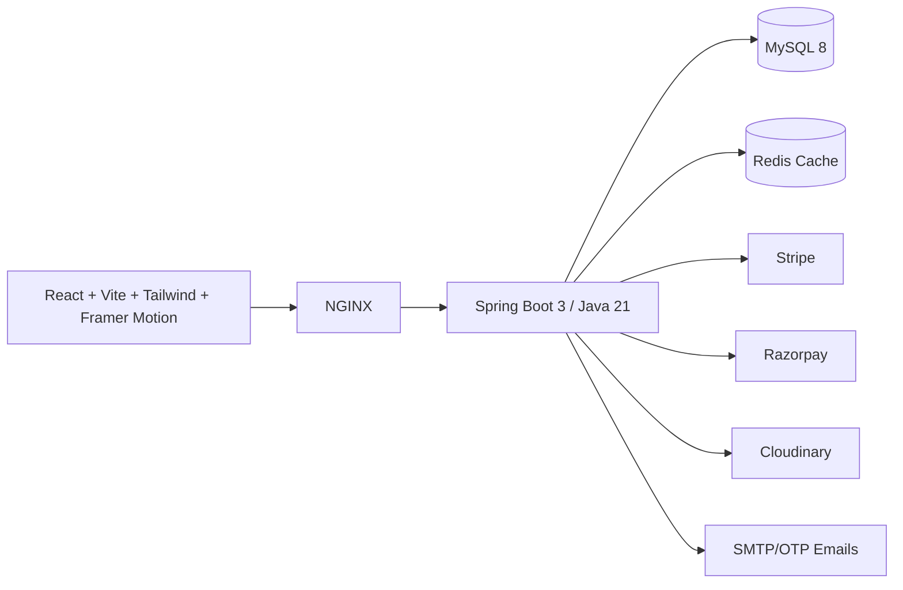

# Vocal — Premium Men's Fashion Commerce

Vocal is a full-stack, production-oriented fashion e-commerce scaffold with a dark luxury UI, JWT-secured Spring Boot APIs, MySQL/Flyway schema, Redis-ready caching, payment gateway seams, and a React/Vite storefront plus admin shell.

## Architecture



## Monorepo Structure

- `backend/` — Spring Boot REST API with Security, JPA, Flyway, OpenAPI, DTOs and service/repository layering.
- `frontend/` — React storefront/admin UI with reusable components, Redux Toolkit, Axios and animations.
- `docs/` — API, database, deployment and product architecture documents.
- `docker-compose.yml` — local MySQL, Redis, API and web stack.
- `.github/workflows/ci.yml` — Maven and Vite CI checks.

## Quick Start

```bash
cp .env.example .env
docker compose up --build
```

- Storefront: http://localhost:8081
- API: http://localhost:8080
- Swagger: http://localhost:8080/swagger-ui/index.html

## One-command local desktop preview

Use these scripts to open the working Vocal preview on your computer without installing npm or Maven dependencies:

- Windows: `scripts\start-preview.bat`
- macOS/Linux: `./scripts/start-preview.sh`

Both scripts serve `frontend/preview/index.html` at http://localhost:4173 and try to open your browser automatically. See `docs/LOCAL_PREVIEW.md` for detailed instructions.

## Dependency-free UI Preview

If npm registry access is unavailable, review the premium Vocal UI with the static preview:

```bash
cd frontend/preview
python3 -m http.server 4173
```

Open http://localhost:4173 to inspect the navbar, hero, collections, shop, product detail, cart, checkout and admin sections.

## Production Notes

1. Replace all placeholder secrets in `.env.example`.
2. Use managed MySQL/Redis and configure daily backups.
3. Serve the frontend behind a CDN with immutable asset caching.
4. Configure Stripe/Razorpay webhooks to verify payment signatures before marking orders as paid.
5. Configure Cloudinary upload presets and restrict media API keys by environment.
