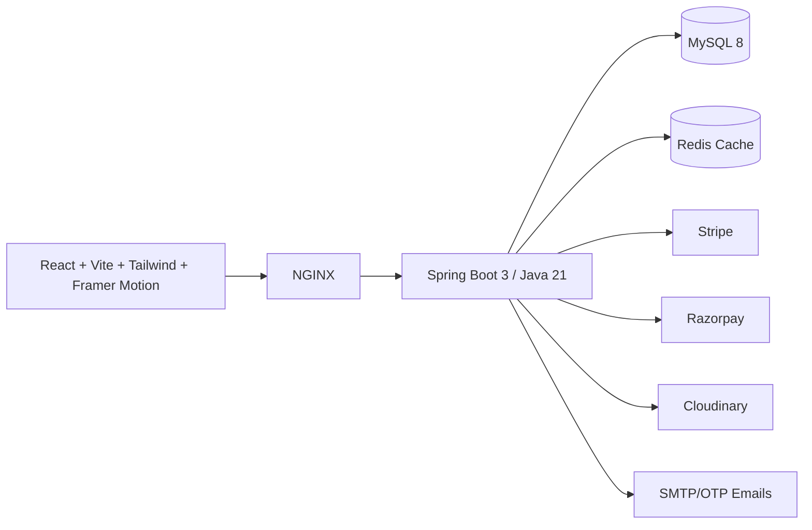

# BlinkMart — Blinkit-like Quick Commerce App

BlinkMart is a production-oriented quick-commerce scaffold inspired by Blinkit. It includes a polished React/Vite storefront, fast grocery discovery, product detail pages, cart, checkout, OTP-style login, admin operations dashboard, JWT-secured Spring Boot APIs, MySQL/Flyway schema, Redis-ready caching and deployment documentation.

## Architecture



## Monorepo Structure

- `backend/` — Spring Boot REST API with Security, JPA, Flyway, OpenAPI, DTOs and service/repository layering.
- `frontend/` — BlinkMart React storefront/admin UI with reusable components, Axios and responsive Tailwind layouts.
- `docs/` — API, database, deployment and product architecture documents.
- `docker-compose.yml` — local MySQL, Redis, API and web stack.
- `docs/CI_TROUBLESHOOTING.md` — frontend CI install/build troubleshooting notes.

## Quick Start

```bash
cp .env.example .env
docker compose up --build
```

- Storefront: http://localhost:8081
- API: http://localhost:8080
- Swagger: http://localhost:8080/swagger-ui/index.html

## Local Browser Preview

Run the Vite storefront locally:

```bash
cd frontend
npm run dev -- --port 4173
```

Open http://localhost:4173 to inspect the BlinkMart home, shop, product detail, cart, checkout, login and admin screens.

## Production Notes

1. Replace all placeholder secrets in `.env.example`.
2. Use managed MySQL/Redis and configure daily backups.
3. Serve the frontend behind a CDN with immutable asset caching.
4. Configure Stripe/Razorpay webhooks to verify payment signatures before marking orders as paid.
5. Configure Cloudinary upload presets and restrict media API keys by environment.
