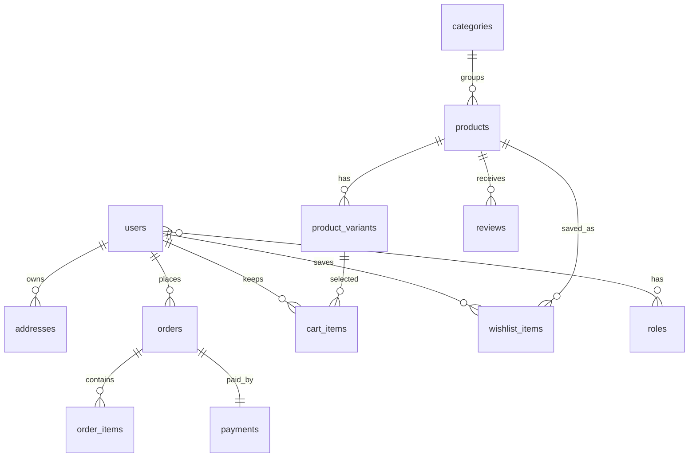

# Vocal Database Design

## Indexing Strategy

- `users.email` unique B-tree for authentication lookup.
- `products.slug` unique B-tree for SEO product URLs.
- `products.name` for autocomplete/search prefix expansion.
- `products.price` for range filters.
- `product_variants.sku` unique B-tree for inventory operations.
- `orders(user_id, created_at)` for customer order history.
- `reviews.product_id` for product rating aggregation.
- Unique cart/wishlist/review pairs prevent duplicates at the database layer.

The executable schema lives in `backend/src/main/resources/db/migration/V1__initial_schema.sql`.
